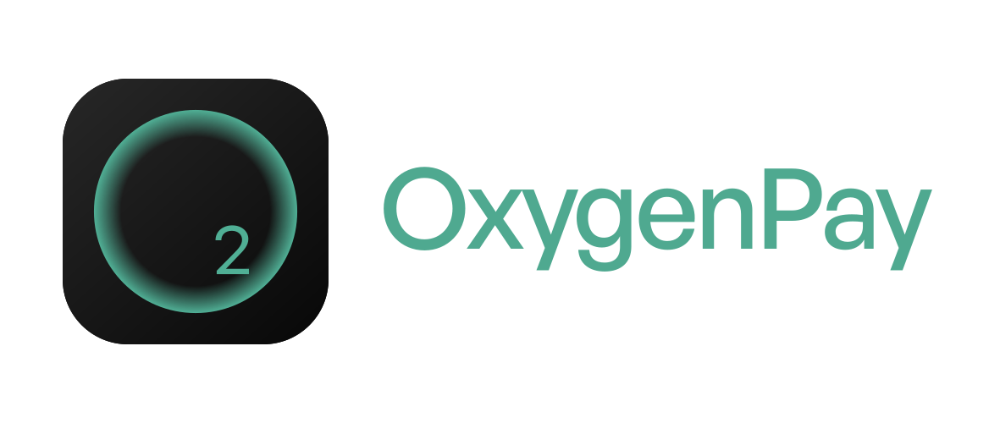
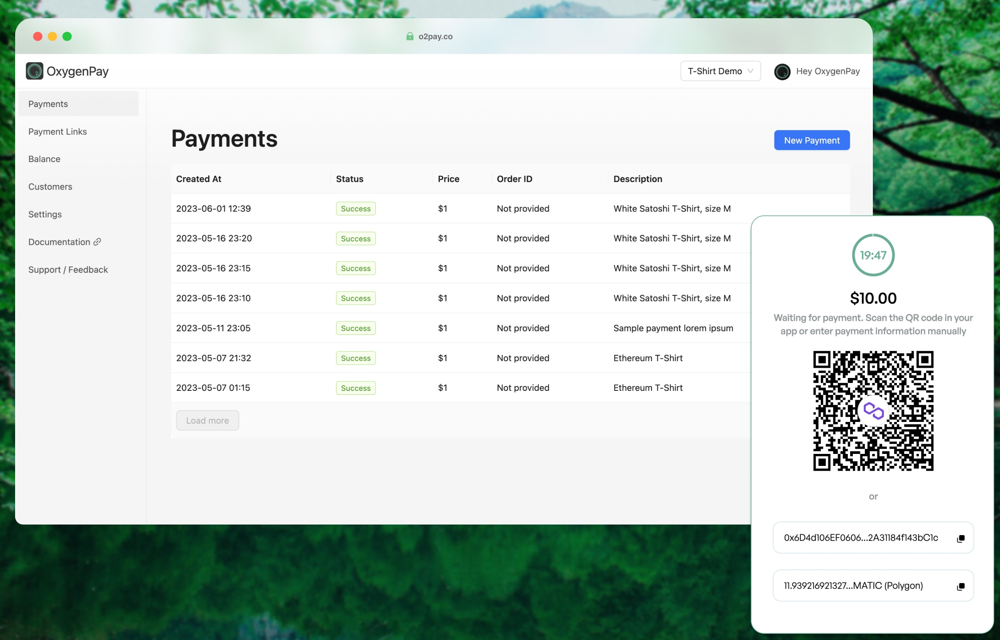

### 2024-07-01

Hello, Internet 🌎 Despite the great journey filled with challenges and learnings, I haven’t found product market fit for this project. Given this, and my current lack of bandwidth and will to continue improving and maintaining it, I’ve arhivie it and move forward. However, I believe this project still holds potential, and I hope someone with the necessary passion and resources might take it forward. 

If you’re interested, feel free to fork the repo and continue its development.

Thank y'all for your support and understanding.

--- 

  

**OxygenPay** is a cloud or self-hosted crypto payment gateway.
Receive crypto including stablecoins with ease. Open new opportunities for your product by accepting cryptocurrency.

## Supported Currencies 🔗

<table>
    <tr>
        <td align="center">
            
            
Ethereum

        </td>
        <td>
            
            
Polygon

        </td>
        <td align="center">
            
            
TRON

        </td>
        <td align="center">
            
            
BNB

        </td>
        <td align="center">
            
            
USDT

        </td>
        <td align="center">
            
            
USDC

        </td>
    </tr>
</table>

## Features ✨

- Self-hosted
- Non-custodial
- Built-in multi-tenancy
- Create payment links for predefined invoices
- Automatic hot wallets management
- Built-in KMS (Key Management Service) for securely storing wallet keys
- Nice and simple merchant dashboard; sleek payment UI
- Easy integration via [API](https://docs.o2pay.co/specs/merchant/v1/) or [webhooks](https://docs.o2pay.co/webhooks)
- No need to setup full-nodes
- Support for testnets
- It's only 1 binary!

## Roadmap 🛣️

- [x] Support for USDC
- [x] Support for Binance Smart Chain (BNB, BUSD)
- [ ] Donations feature
- [ ] Support for [WalletConnect](https://walletconnect.com/)
- [ ] SDKs for (Python, JavaScript, PHP, etc...)
- [ ] Support for all major ETH Layer 2 Chains
- [ ] Support for blockchain notification providers other than Tatum
- [ ] Integration with DEXes for automatic swaps: convert incoming crypto to stablecoins

## License 📑

This software is licensed under [Apache License 2.0](./LICENSE).
